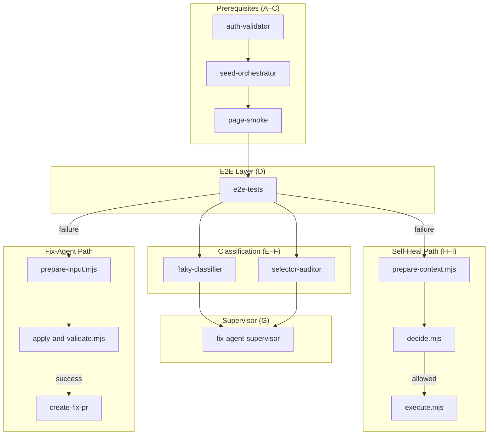

# Agent-Engine Full Fault Scenario Analysis

**Generated:** 2026-02-15  
**Scope:** selector | timeout | availability  
**Validation Checklist:** A–J per scenario

---

## Error-Flow Diagram

---

## Validation Checklist A–J (Definition)

| ID | Check | Description | Validator |
|----|-------|-------------|-----------|
| **A** | Auth Validator | Storage state generated; login succeeds | `auth-validator.js` |
| **B** | Seed Orchestrator | DB seeded; API endpoints return data | `seed-orchestrator.js` |
| **C** | Page Smoke | All 4 pages load; anchors visible | `page-smoke.cjs` |
| **D** | E2E Tests | Full Playwright suite passes | `e2e-tests` job |
| **E** | Flaky Classifier | Classifies flaky vs deterministic | `flaky-classifier.cjs` |
| **F** | Selector Auditor | Detects missing/broken selectors | `selector-auditor.cjs` |
| **G** | Fix-Agent Supervisor | Decision: abort | needs-selector-refactor | run-self-heal | ok | `fix-agent-supervisor.cjs` |
| **H** | Self-Heal Decide | allowed/denied by error_type | `decide.mjs` |
| **I** | Self-Heal Execute | Safe actions (reseed, storage, rerun) | `execute.mjs` |
| **J** | Fix-Agent Apply | Patch + metadata; risk assessment | `apply-and-validate.mjs` |

---

## Fault Injection Points (Implementation)

| Scenario | File | Line | Injection |
|----------|------|------|-----------|
| **selector** | `tests/pages/calendar-page.ts` | 26 | `#appointmentCalendarBROKEN` (non-existent) |
| **timeout** | `tests/e2e/appointment-modal.spec.ts` | 18 | `await page.waitForTimeout(60_000)` (60s sleep) |
| **availability** | `tests/pages/appointment-modal-page.ts` | 163 | `/api/availabilityBROKEN/?` (404 endpoint) |

---

# Scenario 1: SELECTOR

## Fault Mechanism

- **Trigger:** `FAULT_SCENARIO=selector`
- **Location:** `CalendarPage.appointmentCalendar` uses `#appointmentCalendarBROKEN`
- **Effect:** `expect(this.appointmentCalendar).toBeVisible()` fails (element not found)
- **Playwright signal:** `waiting for selector`, `locator(`, `toBeVisible(`

## Checklist A–J Results

| ID | Result | Evidence |
|----|--------|----------|
| **A** | ✅ PASS | auth-validator.js: login, storage state, health check |
| **B** | ✅ PASS | seed-orchestrator.js: seed runs, API returns data |
| **C** | ✅ PASS | page-smoke.cjs uses `#appointmentCalendar`; does NOT receive FAULT_SCENARIO (only e2e-tests job gets it). Page-smoke runs against real DOM → passes. |
| **D** | ❌ FAIL | E2E fails on calendar/appointment tests using CalendarPage |
| **E** | deterministic | flaky-classifier: `--last-failed --repeat-each=2`; selector fail is deterministic → `deterministic-fail` |
| **F** | ✅ ok | selector-auditor checks real DOM (not test code); uses `#appointmentCalendar` in SELECTORS; does NOT receive FAULT_SCENARIO. Real page has element → passes. **Gap:** fault is in test locator, not production DOM. |
| **G** | run-self-heal | fix-agent-supervisor: selector.status === 'ok' (auditor passes). Order: (1) selector issues → needs-selector-refactor, (2) flaky only → abort, (3) deterministic → run-self-heal. Deterministic + selector ok → **run-self-heal**. |
| **H** | ❌ denied | decide.mjs: `allowedForSelfHeal('frontend-selector')` → **false**. Only `infra/network`, `frontend-timing`, `auth/session` allowed. |
| **I** | skipped | execute.mjs: `decision.allowed === false` → `status: skipped`, `reason: not_allowed_by_policy` |
| **J** | patch produced | apply-and-validate.mjs: Cloud Agent classifies `frontend-selector`; `addFirstForStrictLocator` for strict-mode violations; risk: low (+1); test-only scope |

## Cloud Agent Classification

- **api/process-logs.ts:** `selector.test(pl)` matches `strict mode violation|waiting for selector|locator(|toHaveCount(|toBeVisible(` → `frontend-selector`

## Diagnostic Summary (Selector)

| Phase | Outcome |
|-------|---------|
| Prerequisites | A, B, C pass (page-smoke unaffected; selector-auditor checks real DOM) |
| E2E | Fails on calendar tests |
| Flaky | Deterministic |
| Supervisor | `run-self-heal` (deterministic, no selector problem from auditor) |
| Self-Heal | **Denied** — `frontend-selector` not eligible |
| Fix-Agent | **Runs** — classification + instructions → `.first()` patch for strict-mode |

## Recommendations (Selector)

1. **Selector-auditor gap:** It audits production selectors, not test-injected faults. Consider a test-mode that validates against FAULT_SCENARIO.
2. **Supervisor logic:** When flaky says deterministic + Cloud Agent says `frontend-selector`, supervisor still chooses `run-self-heal` because selector-auditor passes. Self-heal then correctly denies.
3. **Fix-Agent:** Correctly produces low-risk selector patch (`.first()` for strict-mode).

---

# Scenario 2: TIMEOUT

## Fault Mechanism

- **Trigger:** `FAULT_SCENARIO=timeout`
- **Location:** `appointment-modal.spec.ts` line 18: `await page.waitForTimeout(60_000)`
- **Effect:** 60s sleep before assertions; may hit test timeout (default 30s or config)
- **Playwright signal:** `Test timeout of`, `Timeout ...ms exceeded`, `expect(`

## Checklist A–J Results

| ID | Result | Evidence |
|----|--------|----------|
| **A** | ✅ PASS | auth-validator |
| **B** | ✅ PASS | seed-orchestrator |
| **C** | ✅ PASS | page-smoke |
| **D** | ❌ FAIL | E2E fails (timeout) |
| **E** | deterministic | flaky-classifier: timeout is deterministic |
| **F** | ✅ ok | selector-auditor: selectors present |
| **G** | run-self-heal | fix-agent-supervisor: auth/seed/smoke ok, no selector issue, deterministic → `run-self-heal` |
| **H** | ✅ allowed | decide.mjs: `frontend-timing` → `allowedForSelfHeal` = true |
| **I** | runs | execute.mjs: reseed_db, rerun_e2e_subset (no regenerate_storage_state for frontend-timing) |
| **J** | patch produced | apply-and-validate.mjs: `frontend-timing` → `addFileLevelTimeoutIfMissing(60_000)` |

## Self-Heal Actions (Timeout)

- `reseed_db` — baseline data
- `rerun_e2e_subset` — validate transience

**Note:** `regenerate_storage_state` only for `auth/session`. `frontend-timing` gets reseed + rerun.

## Cloud Agent Classification

- **api/process-logs.ts:** `timing.test(pl)` matches `Test timeout of|Timeout \d+ms exceeded|expect\(.+\)\.to` → `frontend-timing`

## Diagnostic Summary (Timeout)

| Phase | Outcome |
|-------|---------|
| Prerequisites | All pass |
| E2E | Fails (timeout) |
| Flaky | Deterministic |
| Supervisor | `run-self-heal` |
| Self-Heal | **Allowed** — `frontend-timing` |
| Execute | reseed + rerun (rerun will fail again due to 60s sleep) |
| Fix-Agent | `test.setTimeout(60000)` patch |

## Recommendations (Timeout)

1. **Self-heal rerun:** Will fail again; fault is in test code, not environment.
2. **Fix-Agent:** Correctly adds `test.setTimeout(60000)` to accommodate the injected delay.
3. **Transience:** `frontend-timing` has `transient_likelihood: high` but this fault is deterministic.

---

# Scenario 3: AVAILABILITY

## Fault Mechanism

- **Trigger:** `FAULT_SCENARIO=availability`
- **Location:** `appointment-modal-page.ts` line 163: `url.includes('/api/availabilityBROKEN/?')`
- **Effect:** Modal waits for response from `/api/availabilityBROKEN/?...` — endpoint does not exist → 404 or no response
- **Playwright signal:** Likely `expect(`, timeout waiting for response, or `UI availability check failed`

## Checklist A–J Results

| ID | Result | Evidence |
|----|--------|----------|
| **A** | ✅ PASS | auth-validator |
| **B** | ✅ PASS | seed-orchestrator |
| **C** | ✅ PASS | page-smoke |
| **D** | ❌ FAIL | E2E fails (availability modal tests) |
| **E** | deterministic | flaky-classifier: deterministic |
| **F** | ✅ ok | selector-auditor: selectors present |
| **G** | run-self-heal | Supervisor: deterministic → `run-self-heal` |
| **H** | ❌ denied | decide.mjs: Cloud Agent may classify as `unknown` or `infra/network` (404). If `infra/network` → allowed. If `unknown` → denied. **404 from wrong URL** could match `ECONNREFUSED`-like or fall to `unknown`. Likely **unknown** → denied. |
| **I** | skipped | If denied: skipped. If allowed (infra/network): reseed + rerun. |
| **J** | patch/missing | If classification is `unknown`: no fix_agent_instructions → empty patch, `needs_manual_review`. |

## Cloud Agent Classification (Availability)

- **api/process-logs.ts:** No explicit `availability` type. Possible matches:
  - `network` — if logs show connection/404 errors → `infra/network` (allowed)
  - `selector` — if logs mention locators → `frontend-selector` (denied)
  - Default → `unknown` (denied)

## Diagnostic Summary (Availability)

| Phase | Outcome |
|-------|---------|
| Prerequisites | All pass |
| E2E | Fails (availability API 404) |
| Flaky | Deterministic |
| Supervisor | `run-self-heal` |
| Self-Heal | **Likely denied** — `unknown` or ambiguous |
| Fix-Agent | **Likely no patch** — missing classification/instructions |

## Recommendations (Availability)

1. **Classification gap:** Add `frontend-availability` or `api-404` to Cloud Agent for wrong/missing API URLs.
2. **Fix-Agent:** No targeted fix for availability URL typo without new classification.
3. **Fault design:** Availability fault is API URL interception; differs from selector/timing.

---

# Cross-Scenario Comparison

| Aspect | Selector | Timeout | Availability |
|--------|----------|---------|--------------|
| **E2E** | Fail | Fail | Fail |
| **Cloud classification** | frontend-selector | frontend-timing | unknown / infra/network |
| **Self-heal allowed** | No | Yes | Unclear |
| **Fix-Agent patch** | Yes (.first()) | Yes (setTimeout) | Unlikely |
| **Risk (Fix-Agent)** | Low | Medium | N/A |

---

# File Reference Summary

| File | Role |
|------|------|
| `auth-validator.js` | A: Login, storage state, health |
| `seed-orchestrator.js` | B: Seed DB, verify APIs |
| `page-smoke.cjs` | C: 4 pages, anchors |
| `flaky-classifier.cjs` | E: flaky vs deterministic |
| `selector-auditor.cjs` | F: DOM selector audit |
| `fix-agent-supervisor.cjs` | G: abort | needs-selector-refactor | run-self-heal | ok |
| `prepare-context.mjs` | H input: logs → Cloud Agent → context.json |
| `decide.mjs` | H: allowed by error_type |
| `execute.mjs` | I: reseed, storage, rerun |
| `prepare-input.mjs` | J input: logs → Cloud Agent → input.json |
| `apply-and-validate.mjs` | J: patch, metadata, risk |
| `agent-engine.yml` | Workflow orchestration |
| `backend-setup.yml` | Reusable backend job |
| `api/process-logs.ts` | Cloud Agent classification |

---

---

## Workflow Trigger Notes

- **Fault scenarios** are triggered via `workflow_dispatch` only:  
  `gh workflow run agent-engine.yml -f fault_scenario=selector|timeout|availability`
- **startup-fix-agent** and **self-heal-supervisor** run only when `github.event_name == 'workflow_dispatch'` and E2E fails.
- On **pull_request** events, fault_scenario is empty; self-heal path is skipped.

---

**End of Report**
