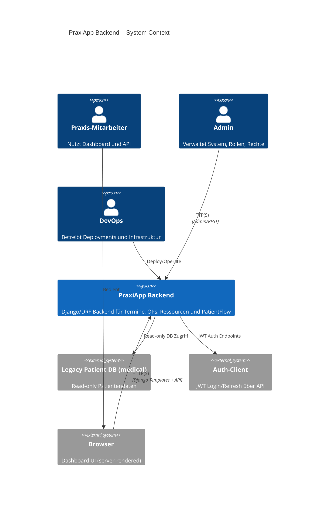
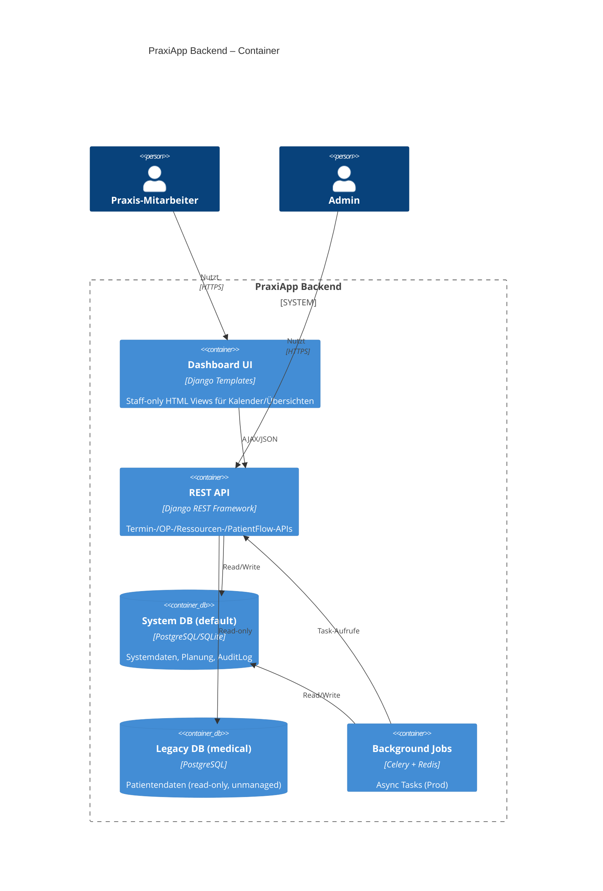
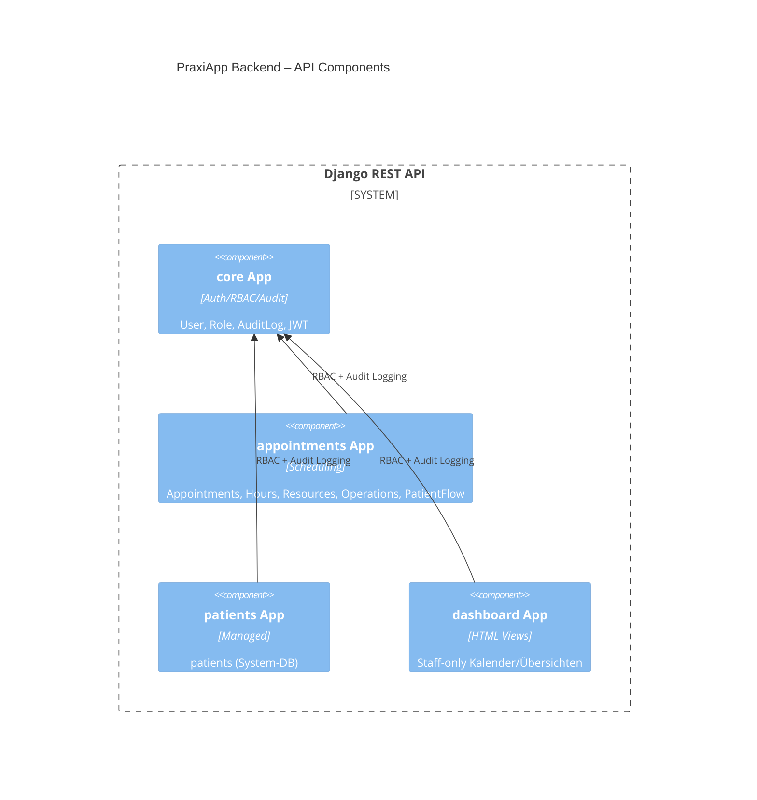

# C4-Diagramm (PraxiApp Backend)

## Level 1 – System Context

```mermaid
C4Context
title PraxiApp Backend – System Context

Person(staff, "Praxis-Mitarbeiter", "Nutzt Dashboard und API")
Person(admin, "Admin", "Verwaltet System, Rollen, Rechte")
Person(devops, "DevOps", "Betreibt Deployments und Infrastruktur")

System(praxi_backend, "PraxiApp Backend", "Django/DRF Backend für Termine, OPs, Ressourcen und PatientFlow")

System_Ext(legacy_db, "Legacy Patient DB (medical)", "Read-only Patientendaten")
System_Ext(idp, "Auth-Client", "JWT Login/Refresh über API")
System_Ext(web, "Browser", "Dashboard UI (server-rendered)")

Rel(staff, web, "Bedient")
Rel(web, praxi_backend, "HTTP(S)", "Django Templates + API")
Rel(admin, praxi_backend, "HTTP(S)", "Admin/REST")
Rel(devops, praxi_backend, "Deploy/Operate")
Rel(praxi_backend, legacy_db, "Read-only DB Zugriff")
Rel(praxi_backend, idp, "JWT Auth Endpoints")
```

## Level 2 – Container

```mermaid
C4Container
title PraxiApp Backend – Container

Person(staff, "Praxis-Mitarbeiter")
Person(admin, "Admin")

System_Boundary(praxi, "PraxiApp Backend") {
  Container(webapp, "Dashboard UI", "Django Templates", "Staff-only HTML Views für Kalender/Übersichten")
  Container(api, "REST API", "Django REST Framework", "Termin-/OP-/Ressourcen-/PatientFlow-APIs")
  ContainerDb(db_default, "System DB (default)", "PostgreSQL/SQLite", "Systemdaten, Planung, AuditLog")
  ContainerDb(db_medical, "Legacy DB (medical)", "PostgreSQL", "Patientendaten (read-only, unmanaged)")
  Container(job, "Background Jobs", "Celery + Redis", "Async Tasks (Prod)")
}

Rel(staff, webapp, "Nutzt", "HTTPS")
Rel(admin, api, "Nutzt", "HTTPS")
Rel(webapp, api, "AJAX/JSON")
Rel(api, db_default, "Read/Write")
Rel(api, db_medical, "Read-only")
Rel(job, db_default, "Read/Write")
Rel(job, api, "Task-Aufrufe")
```

## Level 3 – Components (API – Kernmodule)

```mermaid
C4Component
title PraxiApp Backend – API Components

System_Boundary(api, "Django REST API") {
  Component(core, "core App", "Auth/RBAC/Audit", "User, Role, AuditLog, JWT")
  Component(appointments, "appointments App", "Scheduling", "Appointments, Hours, Resources, Operations, PatientFlow")
  Component(patients, "patients App", "Managed", "patients (System-DB)")
  Component(dashboard, "dashboard App", "HTML Views", "Staff-only Kalender/Übersichten")
}

Rel(appointments, core, "RBAC + Audit Logging")
Rel(patients, core, "RBAC + Audit Logging")
Rel(dashboard, core, "RBAC + Audit Logging")
```
